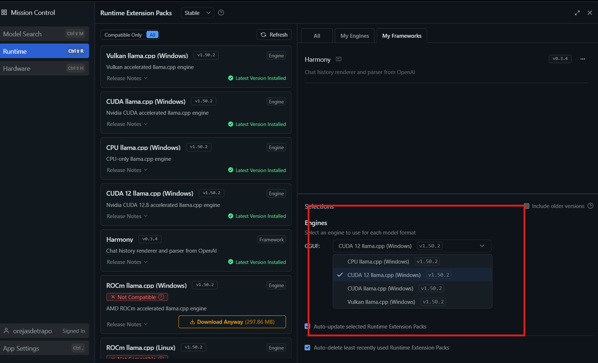
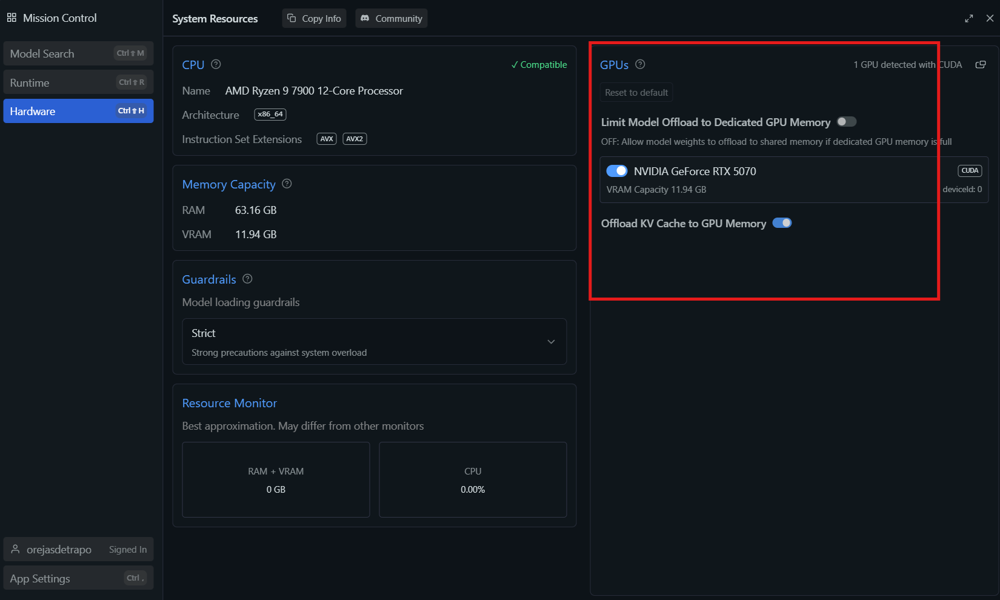
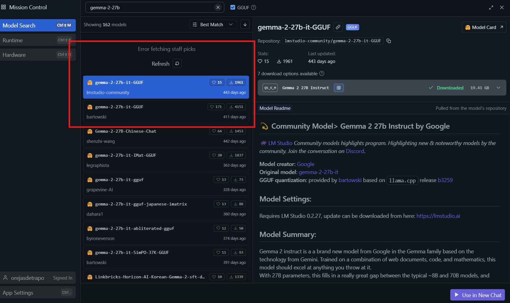
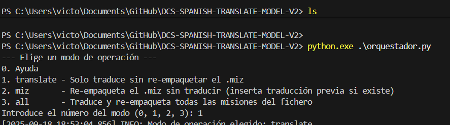
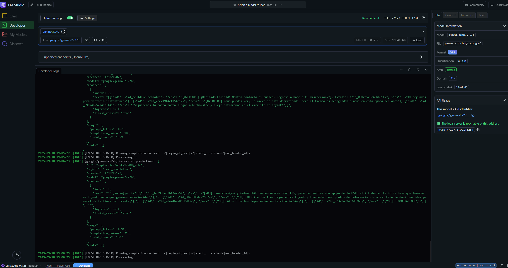

# DCS-SPANISH-TRANSLATE-MODEL-V2

Traductor de misiones DCS al español utilizando un modelo (IA) local y LM Studio.

<br>
<br>

## REQUISITOS

- Requiere Python 3.8+
- LM Studio

<br>
<br>

## USO

1. Instalación de LM STUDIO https://lmstudio.ai/

Configurar segun los requerientos de tu PC, lo ideal es activar el uso de la GPU. 

Se elige el runtime compatible con tu equipo.







<br>
<br>

2. Una vez configurado instalar uno de estos dos modelos, o cualquier otro que quieras probar, se recomiendan los tipo "instruct", lo que he probado son estos dos:

(desde "Discover")

- `lmstudio-community/gemma-2-27b-it-GGUF` : mejor y mas preciso, pero mas lento.

- `unsloth/Qwen3-30B-A3B-Instruct-2507-GGUF` : más rápido, menos preciso.



<br>
<br>

3. Configurar el archivo `misiones.txt`

Estan los ejemplos en el propio fichero.

<br>
<br>

4. Ejecutar el script en la terminal (powershell, cmd o bash) con:

(este llama a `dcs_lua_translate.py`)

```

$ python orquestador.py

```

Lee lo que tengamos en `misiones.txt`, importante dejarlo bien configurado:

- DIR_INPUT
- FILE_TARGET
- DIR_OUTPUT
- ARGS
- Listado de *.miz

Elegimos una de las opciones:

- 0: ayuda

- 1: translate

- 2: miz

- 3: all

Cada una de las opciones está explicada en el propio script.



Podemos ir viendo las traducciones en tiempo real:



En la carpeta que se genera al lanzar la traducción `out_lua`, se encuentran los ficheros de log, asi como un fichero tipo caché , donde se pueden modificar manualmente las traducciones.

La carpeta `temp_missions`, sirve para descomprimir temporalmente el fichero .miz.

<br>
<br>

## EXTRA V1(BETA)

Si queremos usar un modelo público (deepseek, chatgpt, etc) usar el script dentro de la carpeta `EXTRA V1(BETA)`.

Ten en cuenta que necesitarás una cuenta developer y pagar la suscripción a la API.
